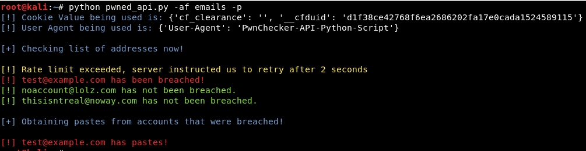

# haveibeenpwned_api

## Description:
This script has been developed to aid penetration testers and red teams in the discovery of breached accounts. All data obtained from this script is sourced from the HaveIBeenPwned.com API provided by Troy Hunt.


## Features:
* Leverages cfscrape in order to obtain CloudFlare cookies to aid in querying the API programatically.
* Queries the API to identify if certain email addresses have been pwned (supports file and single input)
* Can obtain pastes from the API if they exists on email address that have been determined to have been breached.
* Queries the API searching for certain breaches (supports file and single input)
* Can pull down all breached sites in the API.

## Usage Example:
```$ python pwned_api.py -af emails -p```



## Requirements:
```$ pip install cfscrape```
